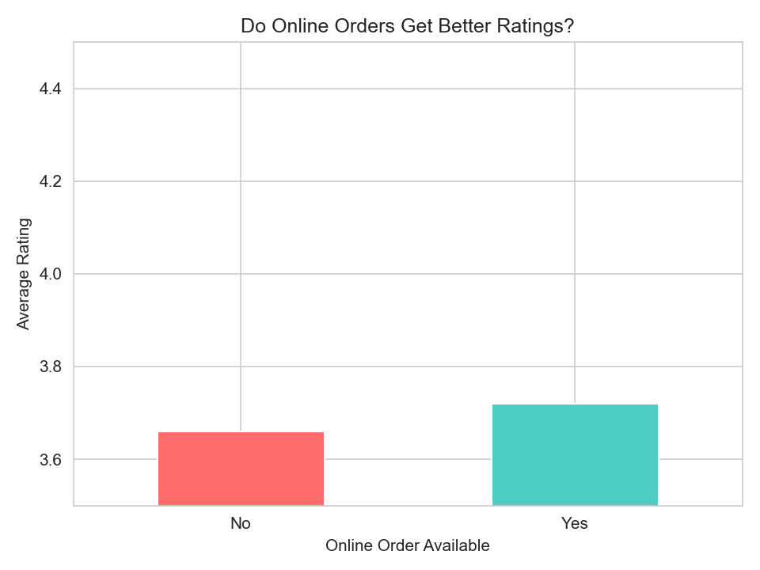
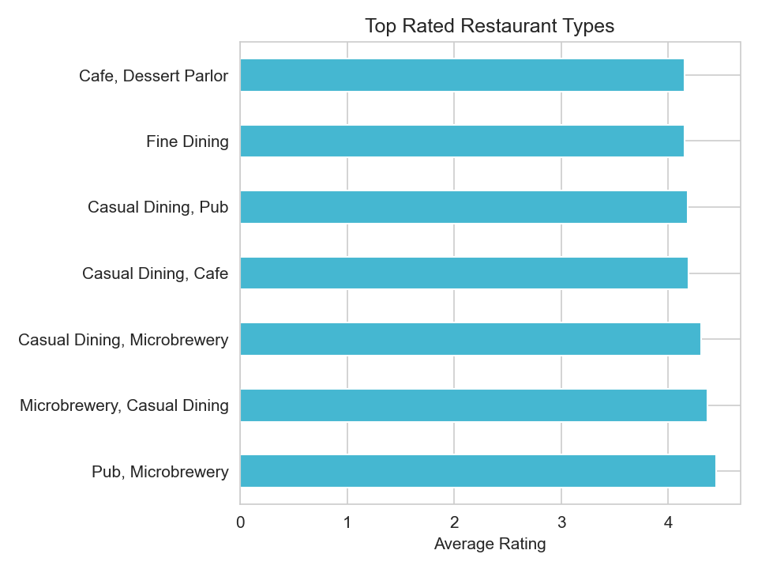
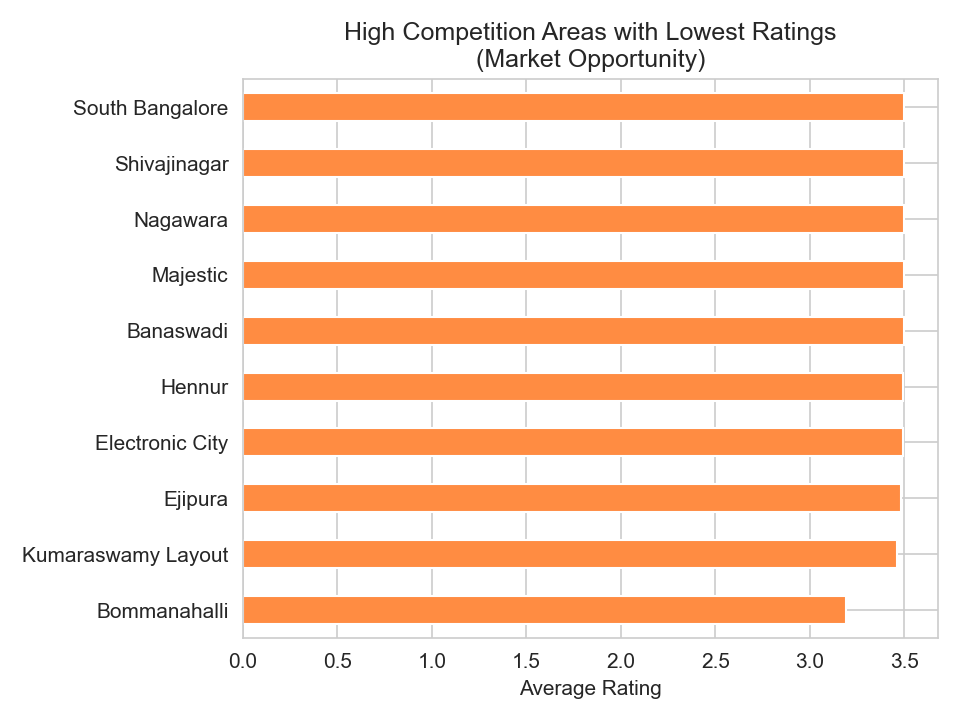
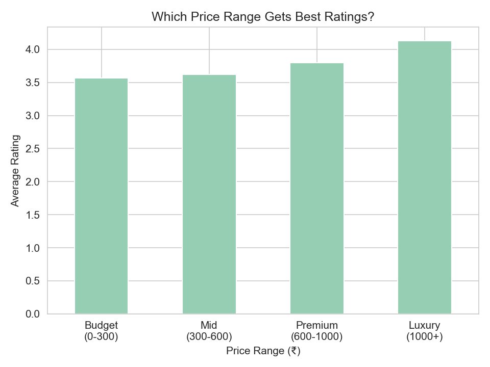

# 🍽️ Zomato Dark Patterns — Pricing & Rating Analysis

## Problem Statement
Do food delivery platforms like Zomato favour certain restaurants 
through visibility and rating algorithms? This project investigates 
pricing strategies and rating distributions across 51,000+ restaurants 
in Bangalore.

## Tools Used
- Python (Pandas, Matplotlib, Seaborn)
- SQL (pandasql)
- Jupyter Notebook

## Dataset
Zomato Bangalore Restaurants Dataset — 
[Kaggle](https://www.kaggle.com/datasets/himanshupoddar/zomato-bangalore-restaurants)

## Key Findings
- Restaurants with online ordering score higher average ratings
- Budget restaurants (under ₹300) outperform mid-range in satisfaction
- Several high-competition Bangalore areas show consistently low 
  ratings — indicating unmet demand and market opportunity
- Quick Service restaurants dominate in votes but not in ratings

## Charts

